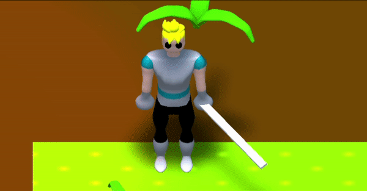

# pixelproject

Pixel Project is an in-development Dev-Tool for the Unity Universal Render Pipeline (URP) that takes 3D objects and renders them as programatically generated pixel art.

The approach utilizes render features, render textures, and shaders to create a post-process effect overtop of the main camera.
